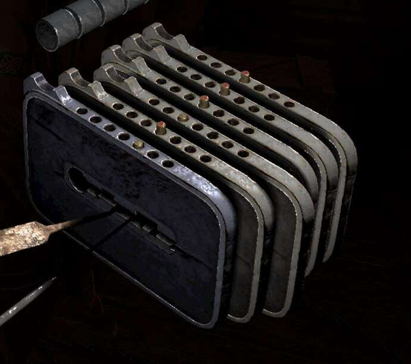
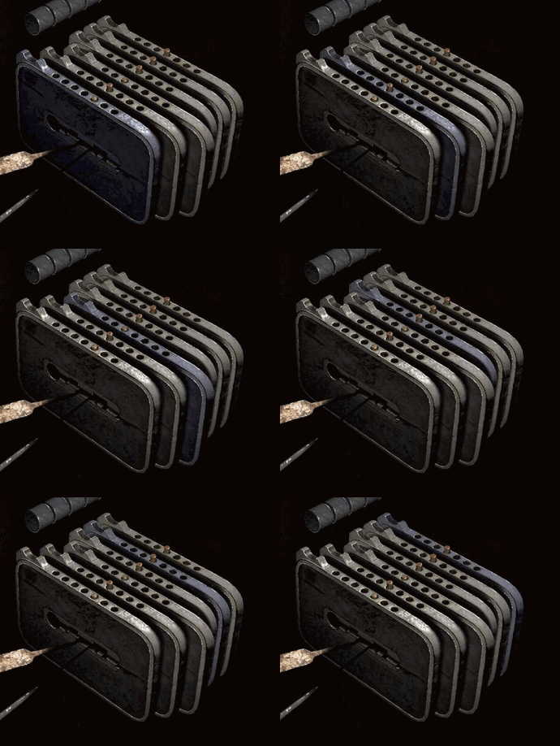

<!-- README.md is generated from README.Rmd. Please edit that file -->

# gothiclockpicker

<!-- badges: start -->

[](https://lifecycle.r-lib.org/articles/stages.html#experimental)
[](https://github.com/szego/gothiclockpicker/actions/workflows/R-CMD-check.yaml)
<!-- badges: end -->

gothiclockpicker finds optimal solutions to the lockpicking puzzles in
the video game *Gothic 1 Remake*.

A lock has several pins, each sitting in their own shackle. Every
operation (sliding a shackle left or right) changes the alignment of
shackle relative to its pin, and also possibly the alignment of other
shackles with respect to their pins. The aim is to center all shackles
on their pins. Given the starting positions and the effect of each
shackle slide, `pick_lock()` returns a shortest sequence of shackle
moves that solves the lock. By default it finds the solution that
minimizes switching between shackles, which tends to be the easiest to
perform in game.

## Installation

You can install the development version of gothiclockpicker from
[GitHub](https://github.com/szego/gothiclockpicker) with:

``` r
# install.packages("remotes")
remotes::install_github("szego/gothiclockpicker")
```

## How to specify the lock

To pick a lock, the solver needs to know two things: a) the initial
state of the lock and b) what moving each shackle does.

Definitions:

1.  The shackles are numbered starting from 1, the nearest shackle.
2.  A shackle is at “position zero” when its pin is in the middle hole.
3.  Moving a shackle to the right increases the position, and moving a
    shackle to the left decreases the position.

Here’s an example of the initial state of a lock:



The first shackle is at position -1, because moving it to the right once
(increasing the position) would put it in position 0, with the pin in
its middle hole. Similarly, shackle 3 is at position 1, because moving
it left would put it in position zero. All the other shackles are
already at position 0.

We can write this initial state as a vector, `c(-1, 0, 1, 0, 0, 0)`.

Next, we need to record what moving each shackle does. Here’s a gif
showing each shackle’s effect, with the selected shackles highlighted in
blue:



Moving the first shackle to the right causes the third and fourth
shackle to move right and the fifth shackle to move left. We can express
this operation as a vector, `c(1, 0, 1, 1, -1, 0)`.

Moving the second shackle to the right causes the first shackle to move
to the right: `c(1, 1, 0, 0, 0, 0)`.

Moving the third shackle causes the first shackle to move to the right
and the sixth shackle to move to the left: `c(1, 0, 1, 0, 0, -1)`.

And the operations for the fourth, fifth, and sixth shackles are \*
`c(0, 0, 0, 1, 0, 0)` \* `c(1, 0, 0, 0, 1, 0)` \* `c(0, -1, 0, 0, 1, 1)`

We pass that initial state and these six operations to `pick_lock()`,
which will print the sequence of shackle moves we need to make to solve
the lock:

``` r
library(gothiclockpicker)

start <- c(-1, 0, 1, 0, 0, 0)
ops <- list(
  c(1, 0, 1, 1, -1, 0),
  c(1, 1, 0, 0, 0, 0),
  c(1, 0, 1, 0, 0, -1),
  c(0, 0, 0, 1, 0, 0),
  c(1, 0, 0, 0, 1, 0),
  c(0, -1, 0, 0, 1, 1)
)

pick_lock(start, ops)
#> Solved in 18 step(s).
#> 
#> Start: (-1, 0, 1, 0, 0, 0) 
#>   + 1 x2  ->  (1, 0, 3, 2, -2, 0)
#>   - 3 x3  ->  (-2, 0, 0, 2, -2, 3)
#>   + 5 x5  ->  (3, 0, 0, 2, 3, 3)
#>   - 4 x2  ->  (3, 0, 0, 0, 3, 3)
#>   - 6 x3  ->  (3, 3, 0, 0, 0, 0)
#>   - 2 x3  ->  (0, 0, 0, 0, 0, 0)
#> Target reached.
```

Each step shows the shackle to slide and its direction (`+`/`-`), and
consecutive repeats of the same operation are grouped together. For
example, the first line says “+ 1 x2”, which means move the first
shackle (1) to the right (+) twice (x2).

The full set of moves to solve the lock starting from the initial state
is: \* “+ 1 x2” - Move the first shackle to the right twice \* “- 3
x3” - Move the third shackle to the left three times \* “+ 5 x5” - Move
the fifth shackle to the right five times \* “- 4 x2” - Move the fourth
shackle to the left twice \* “- 6 x3” - Move the sixth shackle to the
left three times \* “- 2 x3” move the second shackle to the left three
times
